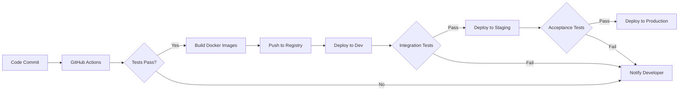

# 🚀 Kafka Messaging System 🚀


A production-ready Kafka messaging system with high availability, fault tolerance, and comprehensive monitoring. This project implements a complete event-driven architecture using Kafka, Kubernetes, Docker, and Terraform.

## 📊 DevOps Architecture Diagram

```mermaid
graph TD
    subgraph "Kubernetes Cluster"
        subgraph "Kafka Namespace"
            ZK["🔄 ZooKeeper Cluster"] --> |manages| KB["📦 Kafka Brokers (x3)"]
            KB --> |stores data| KT["📝 Kafka Topics"]
            KT --> |includes| KT1["posts (6 partitions)"]
            KT --> |includes| KT2["posts.dlq (Dead Letter Queue)"]
        end

        subgraph "Application Layer"
            P["🔼 Producer"] --> |sends messages to| KT1
            C["🔽 Consumer"] --> |reads from| KT1
            C --> |sends failed msgs to| KT2
            CB["🛡️ Circuit Breaker"] --> |protects| C
        end

        subgraph "Monitoring Stack"
            PE["📊 Prometheus Exporter"] --> |exposes metrics| PR["📈 Prometheus"]
            C --> |exposes metrics| PE
            KB --> |exposes JMX metrics| PE
            PR --> |visualizes| GF["📊 Grafana Dashboards"]
        end
    end

    subgraph "CI/CD Pipeline"
        GH["GitHub"] --> |triggers| CI["CI/CD Process"]
        CI --> |builds| DI["Docker Images"]
        DI --> |deploys to| TF["Terraform"]
        TF --> |provisions| "Kubernetes Cluster"
    end

    subgraph "Local Development"
        DC["Docker Compose"] --> |runs local| LK["Local Kafka"]
        DC --> |runs local| LM["Local Monitoring"]
        LK --> |used by| LD["Local Development"]
    end
```

> 💡 **High-Performance Event-Driven Architecture**: This system processes thousands of messages per second with built-in resilience and observability.

## 📑 Table of Contents

- [System Overview](#system-overview)
- [Features](#features)
- [Prerequisites](#prerequisites)
- [Quick Start](#quick-start)
- [Architecture](#architecture)
- [Developer Guide](#developer-guide)
- [Monitoring](#monitoring)
- [Error Handling](#error-handling)
- [Security](#security)
- [Documentation](#documentation)
- [Troubleshooting](#troubleshooting)
- [DevOps Workflow](#devops-workflow)

## 🔍 System Overview

The Kafka messaging system consists of:

- Kafka Cluster: 3 brokers (kafka-1, kafka-2, kafka-3) for high availability
- Producer: Sends messages to the Kafka topic "posts"
- Consumer: Processes messages with retry logic and circuit breaker pattern
- Monitoring: Prometheus and Grafana for metrics collection and visualization

## ✨ Features

- High Availability: Multiple Kafka brokers with replication
- Fault Tolerance: Automatic recovery from failures
- Scalability: Easily scale brokers and applications
- Monitoring: Comprehensive metrics and dashboards
- Error Handling: Retry mechanism, circuit breaker, and dead letter queue
- Security: TLS encryption, authentication, and authorization
- Infrastructure as Code: Terraform and Kubernetes manifests
- Containerization: Docker with best practices
- Automation: Scripts for deployment, testing, and maintenance

## 📋 Prerequisites

- Docker and Docker Compose
- Kubernetes CLI (kubectl)
- Minikube (for local Kubernetes)
- Terraform (optional, for infrastructure provisioning)
- Python 3.8 or later

## 🚀 Quick Start

### Run Demo

The easiest way to get started is to use the demo script:

```bash
./scripts/run-demo.sh
```

This script will:

1. Start the enhanced local development environment
2. Open the Kafka Topics UI and Grafana dashboard
3. Show producer and consumer logs
4. Display consumer metrics

### Local Development Environment

```bash
# Start enhanced local development environment
make enhanced-local-dev
```

The enhanced environment includes:

- Kafka Manager: `http://localhost:9000`
- Kafka Topics UI: `http://localhost:8002`
- Prometheus: `http://localhost:9090`
- Grafana: `http://localhost:3000` (admin/admin123)
- Consumer Metrics: `http://localhost:8000/metrics`

### Kubernetes Deployment

```bash
# Set up Minikube
./scripts/setup-minikube.sh

# Deploy Kafka cluster and applications
./scripts/deploy-and-test.sh

# Check pods
kubectl get pods -n kafka
```

## 🏗️ Architecture

### Kafka Configuration

- Multiple Brokers: For high availability and fault tolerance
- Topics:
  - `posts` with 6 partitions for main messages
  - `posts.dlq` for failed messages (Dead Letter Queue)
- Min In-Sync Replicas: 2 to ensure data durability

### Producer Application

The producer continuously sends JSON messages to the Kafka topic "posts". Each message contains:

- Sender ID
- Content
- Timestamp
- Metadata

### Consumer Application

The consumer processes messages from the Kafka topic with:

- Retry Logic: Retries failed messages up to 3 times
- Circuit Breaker: Prevents cascading failures
- Dead Letter Queue: Stores messages that fail after all retries
- Metrics Export: Exposes metrics for monitoring

## �‍💻 Developer Guide

### Getting Started for Developers

```bash
# Clone the repository
git clone git@github.com:santoshbaruah/Kafka_messaging_system.git
cd Kafka_messaging_system

# Set up local development environment
make enhanced-local-dev

# Run the producer in one terminal
cd producer
python producer.py

# Run the consumer in another terminal
cd consumer
python consumer.py
```

### Development Workflow

1. **Local Development**: Use Docker Compose for local development
2. **Testing**: Write unit tests for your components
3. **Integration Testing**: Test with the local Kafka cluster
4. **Code Review**: Submit a PR for code review
5. **CI/CD**: Automated tests run on GitHub Actions
6. **Deployment**: Deploy to Kubernetes using Terraform

### Code Examples

#### Producer Example

```python
from kafka import KafkaProducer
import json
import time

# Create a producer instance
producer = KafkaProducer(
    bootstrap_servers=['kafka-1:9092', 'kafka-2:9092', 'kafka-3:9092'],
    value_serializer=lambda v: json.dumps(v).encode('utf-8'),
    acks='all',  # Wait for all replicas
    retries=3,   # Retry on failure
)

# Send a message
def send_message(topic, message):
    future = producer.send(topic, message)
    try:
        # Block until message is sent or timeout
        record_metadata = future.get(timeout=10)
        print(f"Message sent to {record_metadata.topic} partition {record_metadata.partition} offset {record_metadata.offset}")
        return True
    except Exception as e:
        print(f"Error sending message: {e}")
        return False

# Example usage
message = {
    'sender_id': 'user123',
    'content': 'Hello Kafka!',
    'timestamp': time.time(),
    'metadata': {'priority': 'high'}
}

send_message('posts', message)
```

#### Consumer Example with Circuit Breaker

```python
from kafka import KafkaConsumer
import json
from circuit_breaker import CircuitBreaker

# Create circuit breaker
circuit_breaker = CircuitBreaker(
    failure_threshold=5,
    recovery_timeout=30,
    name="kafka-consumer"
)

# Create consumer
consumer = KafkaConsumer(
    'posts',
    bootstrap_servers=['kafka-1:9092', 'kafka-2:9092', 'kafka-3:9092'],
    group_id='my-consumer-group',
    auto_offset_reset='earliest',
    value_deserializer=lambda m: json.loads(m.decode('utf-8')),
    enable_auto_commit=False
)

# Process messages
def process_message(message):
    # Your processing logic here
    print(f"Processing message: {message}")
    return True

# Main consumer loop
for message in consumer:
    try:
        # Use circuit breaker to protect processing
        if circuit_breaker.is_closed():
            success = process_message(message.value)
            if success:
                consumer.commit()
                circuit_breaker.record_success()
            else:
                circuit_breaker.record_failure()
        else:
            print("Circuit is open, skipping message processing")
    except Exception as e:
        print(f"Error processing message: {e}")
        circuit_breaker.record_failure()
```

### Best Practices

1. **Error Handling**: Always implement proper error handling and retries
2. **Circuit Breaker**: Use circuit breakers to prevent cascading failures
3. **Monitoring**: Export metrics for all critical components
4. **Security**: Follow security best practices for Kafka
5. **Testing**: Write comprehensive tests for your code
6. **Documentation**: Document your code and APIs

## �📊 Monitoring

### Grafana Dashboards

Access Grafana at [http://localhost:3000](http://localhost:3000) (admin/admin123)

The Advanced Kafka Messaging Dashboard shows:

- Message throughput
- Failed messages
- Consumer lag
- Message processing time
- Message retries
- Kafka broker metrics
- Message success vs. failure rates
- Message processing distribution

To generate test data for the dashboards, run:

```bash
./scripts/test-grafana-dashboard.sh
```

If you don't see data in the dashboards, try restarting the environment:

```bash
./scripts/restart-environment.sh
```

### Prometheus Metrics

The consumer exports metrics that are collected by Prometheus:

- `kafka_consumer_messages_processed_total`: Total messages processed
- `kafka_consumer_dlq_messages_total`: Messages sent to DLQ
- `kafka_consumer_processing_errors_total`: Processing errors
- `kafka_consumer_message_retries_total`: Message retry attempts
- `kafka_consumer_lag`: Consumer lag in messages

## 🛠️ Error Handling

The system includes several error handling mechanisms:

1. Retry Logic: Messages that fail processing are retried up to 3 times
2. Circuit Breaker: Prevents cascading failures by detecting repeated errors
3. Dead Letter Queue: Messages that fail after all retries are sent to a DLQ

You can demonstrate these by:

- Running the test-circuit-breaker.sh script
- Viewing the consumer logs to see retries and circuit breaker events
- Viewing messages in the DLQ

## 🔒 Security

This project implements security best practices:

1. TLS encryption for Kafka communication
2. Authentication and authorization using SASL/SCRAM
3. Non-root container execution with appropriate security contexts
4. Resource limits and requests to prevent resource exhaustion
5. Secrets management using Kubernetes secrets
6. Network policies to restrict pod-to-pod communication
7. Container security contexts with:
   - Dropped capabilities
   - No privilege escalation
   - Seccomp profiles
   - Non-root users
8. Image security with specific version tags and "Always" pull policy

Security scan reports are available in the `terraform/security-reports` directory. See [SECURITY_DECISIONS.md](terraform/security-reports/SECURITY_DECISIONS.md) for documentation on security-related decisions.

## 📚 Documentation

- [Demo Guide](DEMO_GUIDE.md): Step-by-step guide for demonstrating the system
- [Kafka System Documentation](KAFKA_SYSTEM_DOCUMENTATION.md): Comprehensive documentation
- [User Guide](USER-GUIDE.md): Guide for using the application
- [Advanced Features](ADVANCED_FEATURES.md): Information about advanced features

## 🔧 Troubleshooting

If you encounter issues:

1. Check the logs: `docker logs kafka-consumer`
2. Check Prometheus alerts: `http://localhost:9090/alerts`
3. Check Grafana dashboards: `http://localhost:3000`
4. Verify Kafka topics: `docker exec -it kafka-1 kafka-topics --list --bootstrap-server localhost:9092`
5. Reset Grafana password: `./scripts/reset-grafana-password.sh`

## 🎮 Demo Guide

### Quick Demo

For a quick demonstration of the system:

```bash
./scripts/run-demo.sh
```

This script will:

1. Start the enhanced local development environment
2. Open the Kafka Topics UI and Grafana dashboard
3. Show producer and consumer logs
4. Display consumer metrics

### Useful Commands

#### Sending Messages

```bash
# Send a single test message
./scripts/send-test-message.sh

# Send multiple test messages
./scripts/direct-message-sender.sh
```

#### Viewing Messages

```bash
# View messages from Kafka
./scripts/view-kafka-messages.sh --topic posts --from-beginning

# View messages in the DLQ
./scripts/view-kafka-messages.sh --topic posts.dlq --max 5
```

#### Testing Error Handling

```bash
# Test the circuit breaker functionality
./scripts/test-circuit-breaker.sh

# View retry logs
docker logs kafka-consumer | grep "Retry"

# View circuit breaker logs
docker logs kafka-consumer | grep "circuit-breaker"
```

#### Metrics and Dashboards

```bash
# View consumer metrics
curl -s http://localhost:8000/metrics | grep kafka_consumer
```

Access Grafana at [http://localhost:3000](http://localhost:3000) with:

- Username: `admin`
- Password: `admin123`

## �‍💻 Developer Guide

### Getting Started for Developers

```bash
# Clone the repository
git clone git@github.com:santoshbaruah/Kafka_messaging_system.git
cd Kafka_messaging_system

# Set up local development environment
make enhanced-local-dev

# Run the producer in one terminal
cd producer
python producer.py

# Run the consumer in another terminal
cd consumer
python consumer.py
```

### Development Workflow

1. **Local Development**: Use Docker Compose for local development
2. **Testing**: Write unit tests for your components
3. **Integration Testing**: Test with the local Kafka cluster
4. **Code Review**: Submit a PR for code review
5. **CI/CD**: Automated tests run on GitHub Actions
6. **Deployment**: Deploy to Kubernetes using Terraform

### Code Examples

#### Producer Example

```python
from kafka import KafkaProducer
import json
import time

# Create a producer instance
producer = KafkaProducer(
    bootstrap_servers=['kafka-1:9092', 'kafka-2:9092', 'kafka-3:9092'],
    value_serializer=lambda v: json.dumps(v).encode('utf-8'),
    acks='all',  # Wait for all replicas
    retries=3,   # Retry on failure
)

# Send a message
def send_message(topic, message):
    future = producer.send(topic, message)
    try:
        # Block until message is sent or timeout
        record_metadata = future.get(timeout=10)
        print(f"Message sent to {record_metadata.topic} partition {record_metadata.partition} offset {record_metadata.offset}")
        return True
    except Exception as e:
        print(f"Error sending message: {e}")
        return False

# Example usage
message = {
    'sender_id': 'user123',
    'content': 'Hello Kafka!',
    'timestamp': time.time(),
    'metadata': {'priority': 'high'}
}

send_message('posts', message)
```

#### Consumer Example with Circuit Breaker

```python
from kafka import KafkaConsumer
import json
from circuit_breaker import CircuitBreaker

# Create circuit breaker
circuit_breaker = CircuitBreaker(
    failure_threshold=5,
    recovery_timeout=30,
    name="kafka-consumer"
)

# Create consumer
consumer = KafkaConsumer(
    'posts',
    bootstrap_servers=['kafka-1:9092', 'kafka-2:9092', 'kafka-3:9092'],
    group_id='my-consumer-group',
    auto_offset_reset='earliest',
    value_deserializer=lambda m: json.loads(m.decode('utf-8')),
    enable_auto_commit=False
)

# Process messages
def process_message(message):
    # Your processing logic here
    print(f"Processing message: {message}")
    return True

# Main consumer loop
for message in consumer:
    try:
        # Use circuit breaker to protect processing
        if circuit_breaker.is_closed():
            success = process_message(message.value)
            if success:
                consumer.commit()
                circuit_breaker.record_success()
            else:
                circuit_breaker.record_failure()
        else:
            print("Circuit is open, skipping message processing")
    except Exception as e:
        print(f"Error processing message: {e}")
        circuit_breaker.record_failure()
```

### Best Practices

1. **Error Handling**: Always implement proper error handling and retries
2. **Circuit Breaker**: Use circuit breakers to prevent cascading failures
3. **Monitoring**: Export metrics for all critical components
4. **Security**: Follow security best practices for Kafka
5. **Testing**: Write comprehensive tests for your code
6. **Documentation**: Document your code and APIs

## 🔄 DevOps Workflow

### CI/CD Pipeline



### Infrastructure as Code

All infrastructure is defined as code using Terraform and Kubernetes manifests:

1. **Terraform**: Provisions the underlying infrastructure
2. **Kubernetes Manifests**: Define the Kafka cluster and applications
3. **Helm Charts**: Package and deploy applications
4. **GitOps**: Infrastructure changes follow the same workflow as code changes

### Monitoring and Alerting

The system includes comprehensive monitoring and alerting:

1. **Prometheus**: Collects metrics from all components
2. **Grafana**: Visualizes metrics and provides dashboards
3. **Alertmanager**: Sends alerts based on predefined rules
4. **Logging**: Centralized logging with ELK stack

### Disaster Recovery

The system is designed for high availability and disaster recovery:

1. **Backup and Restore**: Regular backups of Kafka data
2. **Multi-AZ Deployment**: Spread across multiple availability zones
3. **Failover**: Automatic failover in case of node failures
4. **Recovery Procedures**: Documented procedures for recovery

## �📂 Directory Structure

```text
├── consumer/                 # Consumer application
│   ├── consumer.py           # Consumer code with DLQ support
│   ├── circuit_breaker.py    # Circuit breaker implementation
│   ├── metrics_exporter.py   # Custom metrics exporter
│   ├── Dockerfile            # Standard Dockerfile
│   ├── Dockerfile.fixed      # Fixed version with basic improvements
│   └── Dockerfile.improved   # Optimized version with security enhancements
├── producer/                 # Producer application
│   ├── producer.py           # Producer code
│   ├── Dockerfile            # Standard Dockerfile
│   └── Dockerfile.improved   # Optimized version with security enhancements
├── k8s/                      # Kubernetes manifests
│   ├── apps/                 # Application manifests
│   ├── kafka/                # Kafka manifests
│   └── monitoring/           # Monitoring manifests
├── terraform/                # Terraform configurations
├── local-dev/                # Local development environment
├── scripts/                  # Automation scripts
│   └── deprecated/           # Deprecated scripts (kept for reference)
├── archive/                  # Archived components (kept for reference)
│   ├── examples/             # Example Python scripts
│   └── mirror-maker/         # Kafka Mirror Maker configuration
└── docs/                     # Documentation
```
