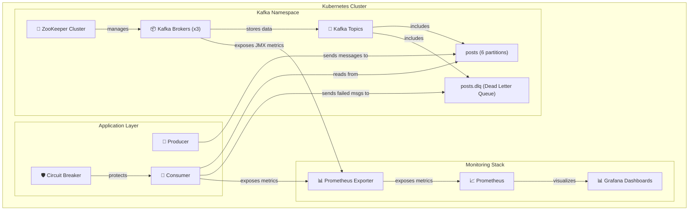
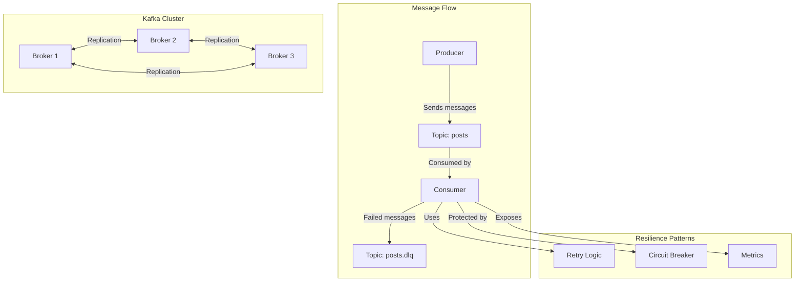
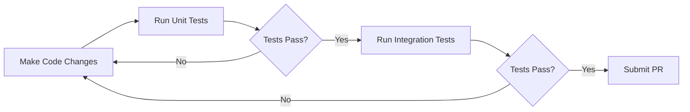
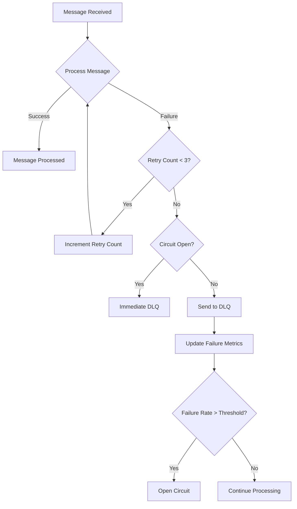
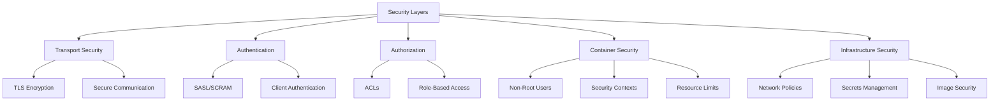
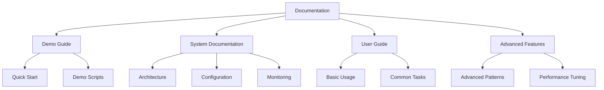
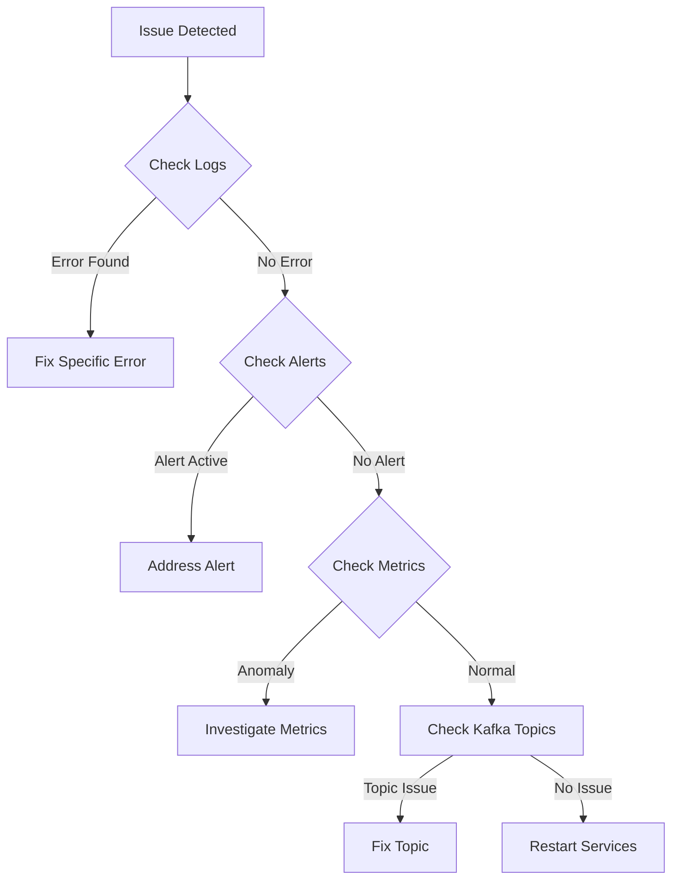
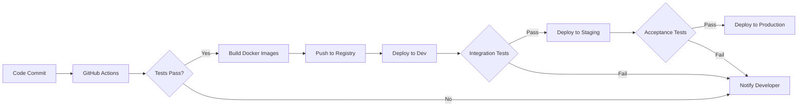

# 🚀 Kafka Messaging System


A production-ready Kafka messaging system with high availability, fault tolerance, and comprehensive monitoring. This project implements a complete event-driven architecture using Kafka, Kubernetes, Docker, and Terraform.

## 📊 DevOps Architecture Diagram



> 💡 **High-Performance Event-Driven Architecture**: This system processes thousands of messages per second with built-in resilience and observability.

## 📑 Table of Contents

- [System Overview](#-system-overview)
- [Features](#-features)
- [Prerequisites](#️-prerequisites)
- [Quick Start](#-quick-start)
- [Architecture](#️-architecture)
- [Developer Guide](#-developer-guide)
- [Monitoring](#-monitoring)
- [Error Handling](#️-error-handling)
- [Security](#-security)
- [Documentation](#-documentation)
- [Troubleshooting](#-troubleshooting)
- [DevOps Workflow](#-devops-workflow)

## 🔍 System Overview

The Kafka messaging system consists of:

- 📦 **Kafka Cluster**: 3 brokers (kafka-1, kafka-2, kafka-3) for high availability
- 🔼 **Producer**: Sends messages to the Kafka topic "posts"
- 🔽 **Consumer**: Processes messages with retry logic and circuit breaker pattern
- 📊 **Monitoring**: Prometheus and Grafana for metrics collection and visualization

## ✨ Features

- 🔄 **High Availability**: Multiple Kafka brokers with replication
- 🛡️ **Fault Tolerance**: Automatic recovery from failures
- 📈 **Scalability**: Easily scale brokers and applications
- 📊 **Monitoring**: Comprehensive metrics and dashboards
- 🔁 **Error Handling**: Retry mechanism, circuit breaker, and dead letter queue
- 🔒 **Security**: TLS encryption, authentication, and authorization
- 🏗️ **Infrastructure as Code**: Terraform and Kubernetes manifests
- 🐳 **Containerization**: Docker with best practices
- 🤖 **Automation**: Scripts for deployment, testing, and maintenance

## 🛠️ Prerequisites

- 🐳 **Docker** and Docker Compose
- ☸️ **Kubernetes CLI** (kubectl)
- 🔄 **Minikube** (for local Kubernetes)
- 🏗️ **Terraform** (optional, for infrastructure provisioning)
- 🐍 **Python 3.8** or later

## 🚀 Quick Start

### 🏃‍♂️ Run Demo

The easiest way to get started is to use the demo script:

```bash
./scripts/run-demo.sh
```

This script will:

1. 🚀 Start the enhanced local development environment
2. 🌐 Open the Kafka Topics UI and Grafana dashboard
3. 📋 Show producer and consumer logs
4. 📊 Display consumer metrics

### 💻 Local Development Environment

To start the enhanced local development environment:

```bash
make enhanced-local-dev
```

The enhanced environment includes:

- 🔍 **Kafka Manager**: `http://localhost:9000`
- 📝 **Kafka Topics UI**: `http://localhost:8002`
- 📊 **Prometheus**: `http://localhost:9090`
- 📈 **Grafana**: `http://localhost:3000` (admin/admin123)
- 📉 **Consumer Metrics**: `http://localhost:8000/metrics`

### ☸️ Kubernetes Deployment

```bash
# Set up Minikube
./scripts/setup-minikube.sh

# Deploy Kafka cluster and applications
./scripts/deploy-and-test.sh

# Check pods
kubectl get pods -n kafka
```

## 🏗️ Architecture



### 📦 Kafka Configuration

- 🔄 **Multiple Brokers**: For high availability and fault tolerance
- 📝 **Topics**:
  - `posts` with 6 partitions for main messages
  - `posts.dlq` for failed messages (Dead Letter Queue)
- 🔒 **Min In-Sync Replicas**: 2 to ensure data durability

### 🔼 Producer Application

The producer continuously sends JSON messages to the Kafka topic "posts". Each message contains:

- 👤 **Sender ID**: Unique identifier for the message sender
- 📄 **Content**: The actual message payload
- ⏱️ **Timestamp**: When the message was created
- 📋 **Metadata**: Additional information about the message

### 🔽 Consumer Application

The consumer processes messages from the Kafka topic with:

- 🔁 **Retry Logic**: Retries failed messages up to 3 times
- 🛡️ **Circuit Breaker**: Prevents cascading failures
- 📮 **Dead Letter Queue**: Stores messages that fail after all retries
- 📊 **Metrics Export**: Exposes metrics for monitoring

## 👨‍💻 Developer Guide

This section provides guidance for developers working with the Kafka messaging system.

### 🔧 Setting Up Development Environment

1. **Clone the repository**:

```bash
git clone git@github.com:santoshbaruah/Kafka_messaging_system.git
cd Kafka_messaging_system
```

1. **Start the development environment**:

```bash
make enhanced-local-dev
```

1. **Install development dependencies**:

```bash
pip install -r requirements-dev.txt
```

### 🧪 Testing

The project includes unit tests, integration tests, and end-to-end tests:

```bash
# Run unit tests
pytest tests/unit

# Run integration tests
pytest tests/integration

# Run end-to-end tests
pytest tests/e2e
```

### 🔄 Development Workflow



### 📝 Coding Standards

- Follow PEP 8 for Python code
- Use type hints
- Write docstrings for all functions and classes
- Maintain test coverage above 80%

### 🏗️ Adding New Features

1. Create a feature branch from `main`
2. Implement the feature with tests
3. Update documentation
4. Submit a pull request

## 📊 Monitoring

### 📈 Grafana Dashboards

Access Grafana at [http://localhost:3000](http://localhost:3000) (admin/admin123)

The Advanced Kafka Messaging Dashboard shows:

- 📊 **Message throughput**: Rate of messages processed
- ❌ **Failed messages**: Count of messages that failed processing
- ⏱️ **Consumer lag**: Difference between produced and consumed messages
- ⏳ **Message processing time**: Time taken to process messages
- 🔁 **Message retries**: Number of retry attempts
- 🖥️ **Kafka broker metrics**: Health and performance of Kafka brokers
- 📉 **Message success vs. failure rates**: Comparison of successful vs failed messages
- 📊 **Message processing distribution**: Distribution of processing times

To generate test data for the dashboards, run:

```bash
./scripts/test-grafana-dashboard.sh
```

If you don't see data in the dashboards, try restarting the environment:

```bash
./scripts/restart-environment.sh
```

### 📊 Prometheus Metrics

The consumer exports metrics that are collected by Prometheus:

- `kafka_consumer_messages_processed_total`: Total messages processed
- `kafka_consumer_dlq_messages_total`: Messages sent to DLQ
- `kafka_consumer_processing_errors_total`: Processing errors
- `kafka_consumer_message_retries_total`: Message retry attempts
- `kafka_consumer_lag`: Consumer lag in messages

## 🛡️ Error Handling

The system includes several error handling mechanisms:

1. 🔁 **Retry Logic**: Messages that fail processing are retried up to 3 times
2. 🛡️ **Circuit Breaker**: Prevents cascading failures by detecting repeated errors
3. 📮 **Dead Letter Queue**: Messages that fail after all retries are sent to a DLQ



You can demonstrate these by:

- 🧪 Running the `test-circuit-breaker.sh` script
- 📋 Viewing the consumer logs to see retries and circuit breaker events
- 📬 Viewing messages in the DLQ

## 🔒 Security

This project implements security best practices:

1. 🔐 **TLS encryption** for Kafka communication
2. 🔑 **Authentication and authorization** using SASL/SCRAM
3. 👤 **Non-root container execution** with appropriate security contexts
4. 📊 **Resource limits and requests** to prevent resource exhaustion
5. 🗝️ **Secrets management** using Kubernetes secrets
6. 🛡️ **Network policies** to restrict pod-to-pod communication
7. 🔒 **Container security contexts** with:
   - Dropped capabilities
   - No privilege escalation
   - Seccomp profiles
   - Non-root users
8. 🏷️ **Image security** with specific version tags and "Always" pull policy



Security scan reports are available in the `terraform/security-reports` directory. See [SECURITY_DECISIONS.md](terraform/security-reports/SECURITY_DECISIONS.md) for documentation on security-related decisions.

## 📚 Documentation

- 📖 [Demo Guide](DEMO_GUIDE.md): Step-by-step guide for demonstrating the system
- 📘 [Kafka System Documentation](KAFKA_SYSTEM_DOCUMENTATION.md): Comprehensive documentation
- 📗 [User Guide](USER-GUIDE.md): Guide for using the application
- 📙 [Advanced Features](ADVANCED_FEATURES.md): Information about advanced features



## 🔧 Troubleshooting

If you encounter issues:

1. 📋 **Check the logs**: `docker logs kafka-consumer`
2. 🚨 **Check Prometheus alerts**: `http://localhost:9090/alerts`
3. 📊 **Check Grafana dashboards**: `http://localhost:3000`
4. 📝 **Verify Kafka topics**: `docker exec -it kafka-1 kafka-topics --list --bootstrap-server localhost:9092`
5. 🔑 **Reset Grafana password**: `./scripts/reset-grafana-password.sh`



## 🎮 Demo Guide

### 🚀 Quick Demo

For a quick demonstration of the system:

```bash
./scripts/run-demo.sh
```

This script will:

1. 🚀 Start the enhanced local development environment
2. 🌐 Open the Kafka Topics UI and Grafana dashboard
3. 📋 Show producer and consumer logs
4. 📊 Display consumer metrics

### 🛠️ Useful Commands

#### 📤 Sending Messages

```bash
# Send a single test message
./scripts/send-test-message.sh

# Send multiple test messages
./scripts/direct-message-sender.sh
```

#### 📥 Viewing Messages

```bash
# View messages from Kafka
./scripts/view-kafka-messages.sh --topic posts --from-beginning

# View messages in the DLQ
./scripts/view-kafka-messages.sh --topic posts.dlq --max 5
```

#### 🧪 Testing Error Handling

```bash
# Test the circuit breaker functionality
./scripts/test-circuit-breaker.sh

# View retry logs
docker logs kafka-consumer | grep "Retry"

# View circuit breaker logs
docker logs kafka-consumer | grep "circuit-breaker"
```

#### 📊 Metrics and Dashboards

```bash
# View consumer metrics
curl -s http://localhost:8000/metrics | grep kafka_consumer
```

Access Grafana at [http://localhost:3000](http://localhost:3000) with:

- Username: `admin`
- Password: `admin123`

## Directory Structure

text
├── consumer/                 # Consumer application
│   ├── consumer.py           # Consumer code with DLQ support
│   ├── circuit_breaker.py    # Circuit breaker implementation
│   ├── metrics_exporter.py   # Custom metrics exporter
│   ├── Dockerfile            # Standard Dockerfile
│   ├── Dockerfile.fixed      # Fixed version with basic improvements
│   └── Dockerfile.improved   # Optimized version with security enhancements
├── producer/                 # Producer application
│   ├── producer.py           # Producermake enhanced-local-dev

The enhanced environment includes:

- Kafka Manager: `http://localhost:9000`
- Kafka Topics UI: `http://localhost:8002`
- Prometheus: `http://localhost:9090`
- Grafana: `http://localhost:3000` (admin/admin123)
- Consumer Metrics: `http://localhost:8000/metrics`

## 📁 Directory Structure

```text
├── consumer/                 # Consumer application
│   ├── consumer.py           # Consumer code with DLQ support
│   ├── circuit_breaker.py    # Circuit breaker implementation
│   ├── metrics_exporter.py   # Custom metrics exporter
│   ├── Dockerfile            # Standard Dockerfile
│   ├── Dockerfile.fixed      # Fixed version with basic improvements
│   └── Dockerfile.improved   # Optimized version with security enhancements
├── producer/                 # Producer application
│   ├── producer.py           # Producer code
│   ├── Dockerfile            # Standard Dockerfile
│   └── Dockerfile.improved   # Optimized version with security enhancements
├── k8s/                      # Kubernetes manifests
│   ├── apps/                 # Application manifests
│   ├── kafka/                # Kafka manifests
│   └── monitoring/           # Monitoring manifests
├── terraform/                # Terraform configurations
├── local-dev/                # Local development environment
├── scripts/                  # Automation scripts
│   └── deprecated/           # Deprecated scripts (kept for reference)
├── archive/                  # Archived components (kept for reference)
│   ├── examples/             # Example Python scripts
│   └── mirror-maker/         # Kafka Mirror Maker configuration
└── docs/                     # Documentation
```

## 🔄 DevOps Workflow


